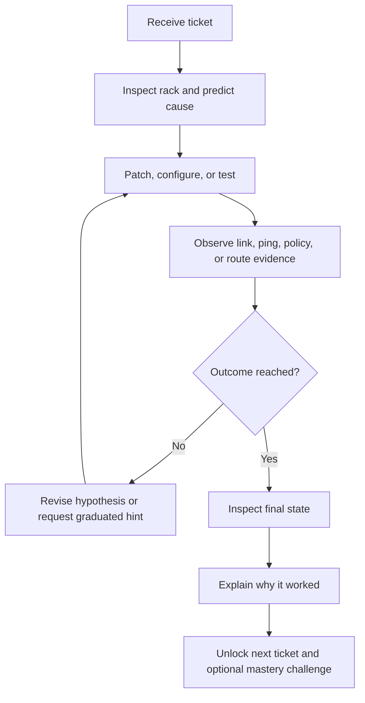

# PatchLab — Game & Learning Design

## 1. Product promise

**Fantasy:** You are the on-call network technician for a growing datacenter. Each ticket restores, expands, or secures the network.

**Player promise:** Every stage teaches one useful networking idea through action, gives immediate evidence, and later asks the player to apply that idea without copying a solution.

**Session target:** 3–7 minutes per stage, with a meaningful decision in the first 20 seconds.

PatchLab should feel like a troubleshooting game, not a form-based quiz and not a full CLI emulator.

---

## 2. Core design principles

### 2.1 One novelty per stage

A stage should introduce **one primary novelty**:

- a device or medium,
- a configuration mechanic,
- a networking concept, or
- a more demanding form of an already learned challenge.

Everything else should reuse familiar skills. Introducing a new device, concept, control, and diagnostic method simultaneously creates cognitive overload rather than satisfying difficulty.

A good stage mix is:

- **70% familiar:** controls and concepts the player already knows,
- **20% current lesson:** the one new idea,
- **10% surprise:** a changed label, address, symptom, or constraint.

### 2.2 Teach, practice, test, revisit

Each concept follows this cadence:

1. **Introduce** — worked ticket with explicit instructions.
2. **Practice** — desired outcome with partial details.
3. **Challenge** — symptoms and constraints; player diagnoses the cause.
4. **Boss** — combines the current concept with older skills.
5. **Revisit** — the concept returns later with changed values or media.

A single successful guided stage is exposure, not mastery.

### 2.3 Completion unlocks learning

Completing the technical outcome should unlock the next stage. Speed, hints, and exploratory mistakes must not block access to curriculum.

Optional recognition can reward:

- independent completion,
- a clean final topology,
- completing an optional timed service-level challenge,
- solving a transfer variant, and
- correctly explaining the cause in the debrief.

Stars should communicate achievement, not act as keys to required lessons.

### 2.4 Failure is evidence

The player loop is:



A failed ping, traceroute, or reasonable hypothesis is not automatically a mistake. Invalid configuration, incompatible media, destructive actions, and unnecessary final cabling can still affect optional efficiency feedback.

### 2.5 Information should fade

Support decreases as expertise grows:

| Stage mode | Brief | Live objectives | Forms | Hints |
|---|---|---|---|---|
| Guided | Exact values and steps | Exact checklist | Helpful defaults | Full ladder |
| Practice | Outcome plus ticket details | Broad objectives | Neutral defaults | Prompt/evidence/action |
| Challenge | Symptoms and constraints | Outcome only | Blank fields | Prompt/evidence |
| Boss | Incident story and service targets | Service outcomes | Only relevant tools | Optional prompt |

The engine’s exact goals remain hidden truth; they do not all need to be displayed as answers.

Players can also choose a **campaign pace**:

| Pace | Behavior |
|---|---|
| Easy (default) | Ticket details stay open, a coach tip appears on the brief and rack, timers stay off, and debrief answers are revealed for reflection. Challenge/boss stages keep practice-level support. |
| Standard | Support follows each stage’s authored mode (guided → practice → challenge → boss). |

---

## 3. Motivation model

PatchLab should support three player needs:

### Competence

- Immediate LED, cable, route, ACL, ping, and traceroute consequences.
- Clear causal feedback: what changed and why.
- A visible skill map showing concepts as Introduced, Practiced, or Independent.

### Autonomy

- Completion opens the next required lesson.
- The player can replay, enter Sandbox, or choose an unlocked practice ticket.
- After a concept introduction, optional challenge variants are available.

### Purpose

- Tickets describe an operational consequence: restore service, isolate a tenant, publish an application, or recover a branch.
- Devices and tools unlock because the datacenter grows, not because a menu arbitrarily changes.

Avoid punitive streaks, random loot, energy systems, and variable-ratio rewards. They do not improve job-relevant learning.

---

## 4. Campaign structure

Replace 15 microchapters with 10 operational arcs. Each arc ends with a capstone ticket.

### Arc 1 — First Shift: Copper Fundamentals

**New equipment:** patch panel, ToR switch, server, Cat6.

| Slot | Existing mission | Mode | New lesson | Player outcome |
|---:|---|---|---|---|
| 1 | M1 First Lights | Introduce | Select endpoints and read link LEDs | Bring the first server online |
| 2 | M2 Wrong Port | Practice | Labels and clean removal | Correct a documented cross-connect |
| 3 | M5 Change Window | Boss | Plan a safe migration | Move service to the assigned path cleanly |

**Reward:** Sandbox basics and the Copper Technician badge.

### Arc 2 — Different Paths: Fiber and Power

**New equipment:** fiber tray, SFP switch, fiber NIC, PDU, PSUs.

| Slot | Existing mission | Mode | New lesson | Player outcome |
|---:|---|---|---|---|
| 4 | M6 Fiber First | Introduce | OM4/LC fiber | Light the first fiber path |
| 5 | M7 Wrong Media | Practice | Media/connector diagnosis | Replace an incompatible cord |
| 6 | M9 Power Up | Boss | Power is a prerequisite to data | Build power and data paths in the right order |

**Reward:** Fiber and PDU devices in Sandbox.

### Arc 3 — Dark Ports: Administrative Recovery

**New mechanic:** interface administrative state.

| Slot | Existing mission | Mode | New lesson | Player outcome |
|---:|---|---|---|---|
| 7 | M4 Admin Down | Introduce | Recognize an admin-down symptom | Restore service using a safe spare path |
| 8 | M23 No Shutdown | Practice | Repair the root cause | Re-enable the documented interface |
| 9 | M28 Fiber No Shutdown | Boss | Transfer the same diagnosis to fiber | Recover an SFP path without repatching |

**Reward:** Interface controls and Recovery badge.

### Arc 4 — Console Room: Addressing and Operations

**New equipment/tools:** console server, rollover cable, IPv4 editor, ping.

| Slot | Existing mission | Mode | New lesson | Player outcome |
|---:|---|---|---|---|
| 10 | M10 Console & Mgmt IP | Introduce | Out-of-band access and management IP | Attach the exact TTY and address the switch |
| 11 | M11 Subnet Ping | Introduce | Same-subnet reachability | Address and verify a server |
| 12 | M19 Broken Address | Challenge | Diagnose an address on the wrong network | Repair reachability from symptoms |
| 13 | M20 Mask Trap | Challenge | Prefix length changes network membership | Find the mask fault without a disclosed answer |
| 14 | M29 Spare PDU | Boss | Combine power recovery and ping evidence | Restore two devices and prove service |

**Reward:** Ping tool, Addressing badge, and advanced Sandbox addressing.

### Arc 5 — The Policy Desk: ACL Foundations

**New equipment/tool:** firewall policy table.

| Slot | Existing mission | Mode | New lesson | Player outcome |
|---:|---|---|---|---|
| 15 | M12 Firewall ACL | Introduce | Permit rules and implicit deny | Restore approved traffic |
| 16 | M18 Deny One Host | Boss | First-match order and `/32` specificity | Block one host while preserving another |

**Reward:** ACL editor and Policy badge.

### Arc 6 — Tenant Floors: VLANs

**New mechanic:** access VLAN assignment and isolation.

| Slot | Existing mission | Mode | New lesson | Player outcome |
|---:|---|---|---|---|
| 17 | M13 Access VLAN | Introduce | Configure an access VLAN | Place a server in its assigned tenant |
| 18 | M3 VLAN Trap | Practice | Diagnose a VLAN mismatch from evidence | Repair a misplaced endpoint |
| 19 | M14 VLAN Isolation | Challenge | Layer-2 isolation | Prove two same-subnet hosts are isolated by VLAN |
| 20 | M8 Dual Servers | Boss | Multi-endpoint VLAN deployment | Bring two tenants online cleanly |

**Required simulator improvement:** M14 must use VLAN-aware L2 forwarding and same-subnet hosts; different IP subnets alone must not prove isolation.

**Reward:** VLAN controls, tenant presets, and Switching badge.

### Arc 7 — Beyond the Rack: Gateways and Uplinks

**New equipment/mechanics:** WAN peer, default gateway, trunk, inter-VLAN routing.

| Slot | Existing mission | Mode | New lesson | Player outcome |
|---:|---|---|---|---|
| 21 | M15 Default Gateway | Introduce | Off-subnet forwarding | Reach the ISP peer through the gateway |
| 22 | M24 Wrong Gateway | Challenge | Diagnose gateway failure | Repair only the incorrect gateway |
| 23 | M16 Trunk Uplink | Introduce | Trunk mode | Carry multiple VLANs over an uplink |
| 24 | M21 Inter-VLAN | Boss | Routed communication between VLANs | Build and verify bidirectional routed service |

**Content correction:** Decide whether M21 teaches a routed multi-interface firewall or router-on-a-stick. The topology and lesson text must agree.

**Reward:** WAN peer, trunk controls, and Uplink badge.

### Arc 8 — Publishing Services: NAT

**New mechanic:** translation.

| Slot | Existing mission | Mode | New lesson | Player outcome |
|---:|---|---|---|---|
| 25 | M17 Static NAT | Introduce | One-to-one inbound publication | Publish one internal service at an exact public IP |
| 26 | M31 PAT Overload | Boss | Many-to-one outbound translation | Restore LAN egress with overload |

**Required simulator improvement:** probes should be able to target the public IP so static NAT proves translation rather than merely the presence of a rule.

**Reward:** NAT/PAT tools and Edge Services badge.

### Arc 9 — Route Craft: Choosing Paths

**New equipment/mechanics:** branch site, route table, longest prefix, administrative distance.

| Slot | Existing mission | Mode | New lesson | Player outcome |
|---:|---|---|---|---|
| 27 | M22 Static Route | Introduce | Route to a remote prefix | Reach BRANCH through a next hop |
| 28 | M25 Host Route | Challenge | Longest-prefix match | Override one destination with `/32` |
| 29 | M30 Floating Static | Boss | Backup path selection | Recover after the preferred route becomes unavailable |

**Content correction:** failover must make the preferred next hop/interface unresolved or model tracking. End-to-end failure alone should not cause a real floating static to replace an installed route.

**Reward:** Advanced routing controls and Route Craft badge.

### Arc 10 — Incident Commander: Security Capstone

**New challenge:** incomplete incident information and multi-layer diagnosis.

| Slot | Existing mission | Mode | New lesson | Player outcome |
|---:|---|---|---|---|
| 30 | M26 Deny Branch | Practice | Apply prior ACL reasoning to a routed destination | Block one branch client selectively |
| 31 | M27 Branch Exception | Challenge | Specific permit above broad deny via OOB recovery | Carve a safe exception without opening the LAN |
| 32 | M32 Traceroute | Campaign Boss | Use hop evidence to isolate a layered fault | Diagnose and restore an end-to-end branch path |

M32 should not disclose both the route and ACL answer. It should present symptoms, show where traceroute stops, and require the player to identify the failing layer.

**Reward:** Incident Commander badge, all Sandbox equipment, and randomized challenge tickets.

---

## 5. Difficulty curve

Difficulty should rise in waves, not as a straight line:

```text
Arc difficulty
1: 1 → 1 → 2
2: 1 → 2 → 3
3: 2 → 2 → 3
4: 2 → 2 → 2 → 3 → 3
5: 2 → 3
6: 2 → 2 → 3 → 3
7: 3 → 2 → 2 → 4
8: 3 → 4
9: 3 → 4 → 5
10: 3 → 4 → 5
```

After every boss, the next arc begins with a lower-pressure introduction. This alternation protects flow and gives a sense of growth.

---

## 6. Mission data contract

The engine needs exact goals, while the game UI needs learning and presentation metadata. Keep those concerns separate.

```ts
type MissionMode = 'guided' | 'practice' | 'challenge' | 'boss';
type Difficulty = 1 | 2 | 3 | 4 | 5;

type ToolId =
  | 'patch'
  | 'power'
  | 'console'
  | 'ip'
  | 'switchport'
  | 'acl'
  | 'nat'
  | 'pat'
  | 'route'
  | 'ping'
  | 'traceroute';

interface LearningDesign {
  mode: MissionMode;
  difficulty: Difficulty;
  conceptsIntroduced: string[];
  conceptsPracticed: string[];
  deviceUnlocks?: string[];
  enabledTools: ToolId[];
  visibleObjectives: string[];
  ticketDetails?: string[];
  debrief: {
    outcome: string;
    explanation: string;
    question: string;
    answer: string;
  };
  hints: {
    prompt: string;
    evidence: string;
    action: string;
    solution?: string;
  };
}
```

Add `learning: LearningDesign` to each mission. Exact engine `goals` remain authoritative but are not automatically rendered as the player-facing checklist.

Catalog validation should enforce:

- every mission has one primary introduced concept at most,
- a concept is introduced before it is used in challenge mode,
- every boss practices at least two previously introduced concepts,
- enabled tools cover all required goal types,
- challenge/boss stages do not expose exact solutions in visible objectives,
- every introduced concept is revisited later,
- difficulty changes by no more than two points between adjacent stages.

Authoring voice, anti-spoiler rules, and transfer guidance: [MISSION_AUTHORING.md](./MISSION_AUTHORING.md). Automated checks live in `src/missions/learningDesign.test.ts`. Challenge/boss Impact copy uses `learning.impact` (not `ticketDetails[0]`), so Standard pace does not leak Easy ticket recipes.

---

## 7. Target stage loop

### Brief

Show:

- incident/ticket story,
- service outcome,
- constraints,
- new equipment or capability unlocked for this stage,
- mode and estimated difficulty.

Do not show every exact engine goal by default. Guided stages may expose an expanded checklist. Practice and challenge stages use an optional **Ticket details** disclosure.

### Rack

- Show only mission-relevant configuration tools.
- Keep immediate physical/logical evidence.
- Display broad service objectives, not solution values.
- Allow hints at any time through a graduated ladder.
- Pause the automatic transition on success and let the player inspect the final state.

### Debrief

Show mission-specific information:

1. **Outcome:** what service was restored, blocked, or published.
2. **Cause:** why the final configuration works.
3. **Evidence:** final link/VLAN/route/policy/probe facts.
4. **Reflection:** one retrieval question, then reveal the answer.
5. **Performance:** neutral optional achievements such as Independent, Clean Rack, or Under SLA.
6. **Reward:** new device/tool, concept progress, and next ticket.

Do not use a generic practice list for every mission.

---

## 8. Hint ladder

Hints are safe learning support and should not block progression.

1. **Prompt** — directs attention without revealing the fault.
   - “Is the failure physical, VLAN, addressing, routing, or policy?”
2. **Evidence** — identifies a relevant observation.
   - “The server NIC expects VLAN 20; the attached switchport is VLAN 10.”
3. **Action** — names the class of correction.
   - “Move to or configure a VLAN 20 access port.”
4. **Solution** — exact value/path, only when requested.
   - “Set Gi1/0/6 to access VLAN 20.”

Track the highest support level used for personal feedback. Do not subtract a required progression currency.

---

## 9. Progress and rewards

### Required curriculum progress

- A technically completed stage unlocks the next stage.
- A completed arc unlocks its new Sandbox equipment and badge.
- Sandbox basics unlock after the first boss (campaign slot 3); additional devices unlock by arc.

### Optional mastery

Use three legible achievements rather than opaque gated stars:

- **Independent** — completed without Action/Solution hint levels.
- **Clean Rack** — no unnecessary final cables or destructive detours.
- **Under SLA** — completed under par in an explicitly timed challenge.

The player can replay for achievements, but no required lesson is blocked.

### Concept states

Each concept progresses through:

- **Introduced** — guided completion,
- **Practiced** — later practice completion,
- **Independent** — challenge completion without direct solution,
- **Ready for review** — enough time has passed or support was needed recently.

This is more educationally meaningful than a single total-star number.

---

## 10. Implementation roadmap

Phases 1–2 from the original redesign are largely shipped (campaign arcs, learning metadata, mastery, transfers, anti-spoiler briefs).

**Current roadmap:** [ROADMAP.md](./ROADMAP.md) — R0 docs → R1 cadence → R2 diagnosis depth → R3 replay → R4 classroom.

---

## 11. Acceptance criteria

The redesign is successful when:

- A new player reaches the first successful link in under 60 seconds.
- Every stage introduces at most one major new concept or control family.
- Every concept has introduction, practice, and later retrieval evidence.
- Completing a valid technical outcome always unlocks the next required lesson.
- Requesting help never prevents curriculum progress.
- Challenge stages can be solved without reading exact answer values.
- Debriefs name the actual mission concept and explain cause/effect.
- The configuration panel contains no irrelevant tool sections during campaign play.
- Boss stages combine prior skills and provide less explicit guidance.
- Simulation evidence—not an unrelated cable or configuration object—proves VLAN, NAT, route, ACL, ping, and traceroute outcomes.
