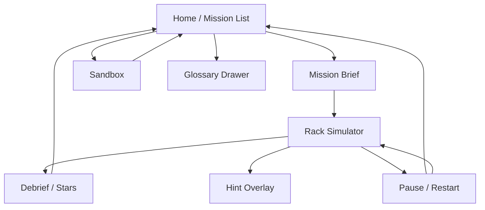
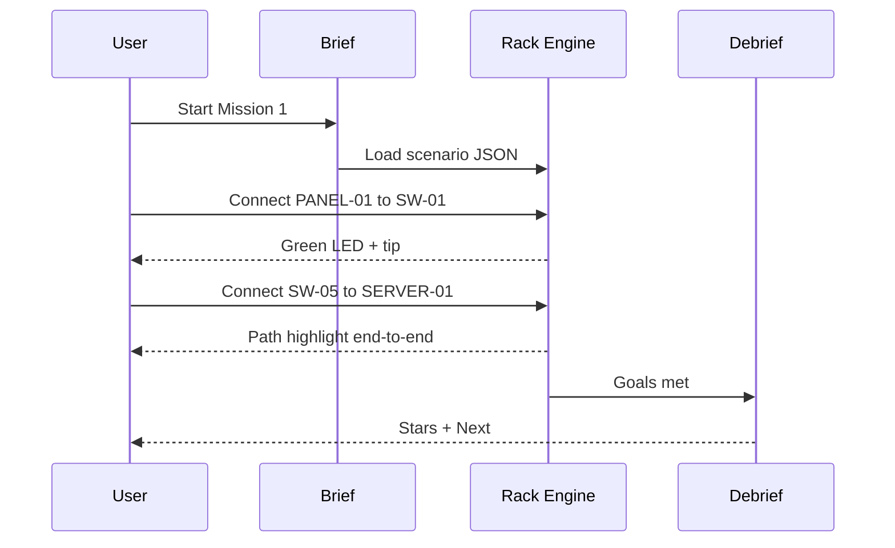
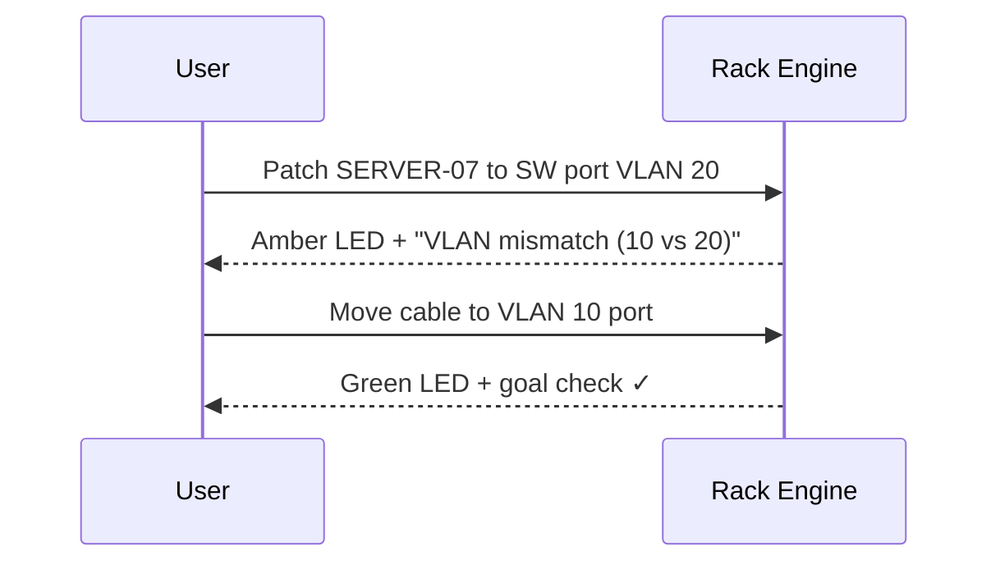

# PatchLab — Screen Map & Interaction Flows

## App map



---

## 1. Home / Mission List

**Purpose:** Choose what to practice.

**Content**
- App name **PatchLab** as hero brand mark
- Progress strip (missions cleared, total stars)
- Mission cards 1–5 (locked until previous cleared, except M1)
- Sandbox button (locked until M3 complete)
- Settings: sound, reduced motion, left/right hand tap order

**Desktop:** vertical list + preview thumbnail of rack.  
**Mobile:** stacked missions; brand + one CTA above fold.

---

## 2. Mission Brief

**Purpose:** One goal before touching cables.

**Content**
- Mission title + 1–2 sentence objective
- Constraints (“Use only blue patch cables”, “Match labels”)
- Win checklist (2–4 bullets)
- CTA: **Start patching**

**Rules**
- No stats, no secondary promos
- No rack visible yet (keeps first beat focused)

---

## 3. Rack Simulator (core)

**Purpose:** Interactive patching with instant feedback.

### Layout

```
┌─────────────────────────────────────────────┐
│ [←] Mission title          Timer   Hints    │
├─────────────────────────────────────────────┤
│                                             │
│   PATCH PANEL (1U)   ○ ○ ○ ○ ○ ○ ○ ○        │
│                                             │
│   TOR SWITCH (1U)    ● ● ● ● ● ● ● ●        │
│                                             │
│   SERVER-01          [NIC]                  │
│   SERVER-07          [NIC]                  │
│                                             │
│   (cables as colored curves between ports)  │
├─────────────────────────────────────────────┤
│ Tip: Link up — VLAN 10 path complete        │
│ Cable tray: Cat6 x N                        │
└─────────────────────────────────────────────┘
```

### Port states (visual)

| State | Look |
|---|---|
| Empty | Dim outline |
| Selected (first tap/click) | Pulse ring |
| Occupied / linked | Solid + cable attached |
| Link up | Green LED |
| Link down / fault | Amber or red LED |
| Goal port (optional hint) | Soft ghost outline |

### Interactions

**Desktop**
1. Pointer-down on port A → start cable ghost  
2. Drag to port B → release to connect  
3. Click existing cable → select; Delete/Backspace removes  
4. Hover port → tooltip: name, VLAN, label

**Mobile**
1. Tap port A (selected)  
2. Tap port B (connect)  
3. Tap cable then **Unplug** button  
4. Pinch-zoom only if scene wider than Mission 3+

### Feedback bus (always visible footer tip)

Examples:
- `Connected PANEL-03 → SW-03`
- `No link — switch port is admin down`
- `No link — VLAN mismatch (10 vs 20)`
- `Label mismatch — ticket expects SERVER-07`

### Chrome allowed in rack view
- Mission title, timer, hint button, pause
- Cable inventory count
- Live tip line

### Chrome forbidden in rack view
- Long tutorials, glossary walls, star math, ads

---

## 4. Hint Overlay

**Purpose:** Unstick without teaching the whole lesson again.

- Shows one suggested next cable as a ghost path
- Costs 1 cleanliness/help star if used
- Available after 2 incorrect attempts or 90s idle (mission-configurable)

---

## 5. Debrief / Stars

**Purpose:** Close the loop; reinforce why.

**Content**
- 3 stars: Correctness / Speed / Cleanliness
- 3 bullet “what you practiced”
- Wrong moves list (max 3), each with the tip that fired
- CTAs: **Next mission** / **Retry** / **Sandbox**

---

## 6. Sandbox

**Purpose:** Free play after basics.

- Same rack, no timer
- Toggle VLANs on switch ports via simple inspector
- Reset rack button
- No stars; optional “challenge seeds”

---

## 7. Glossary (drawer)

Short definitions: VLAN, patch panel, ToR, T568B, link light, label. Opened from Home or Pause — never auto-blocking mid-mission.

---

## Key flows

### Happy path — Mission 1



### Fault path — VLAN mismatch



---

## Responsive rules

| Breakpoint | Behavior |
|---|---|
| ≥ 900px | Side legend + wider rack; drag-and-drop default |
| &lt; 900px | Landscape preferred; tap-to-tap; larger hit targets (≥ 44px) |
| Reduced motion | Instant LED changes; no cable fling animation |

---

## Accessibility

- Ports focusable via keyboard (Tab / Enter connect mode)
- Tips also announced as live region (`aria-live="polite"`)
- Color never sole signal — LED + text tip + optional icon
